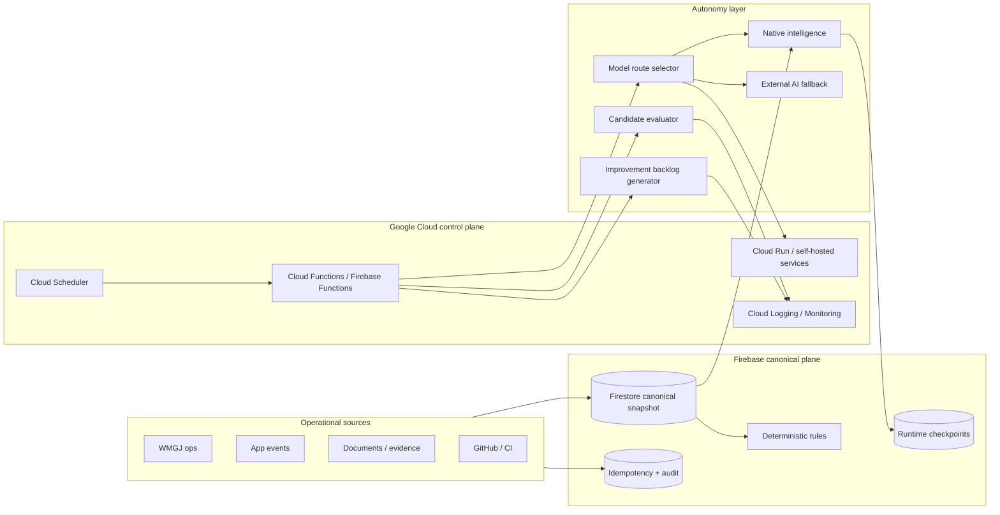

# AURORA NEXUS — Self-Sufficient Engine

## Purpose

This document defines the target architecture for an autonomous improvement motor built on Firebase and Google Cloud that progressively reduces dependence on external AI.

## Target architecture

## Components

### Canonical data plane

- Firestore stores the authoritative snapshot.
- Audit and idempotency stay in existing Firebase structures.
- Runtime checkpoints persist state transitions and operational learning.

### Deterministic intelligence

- Native rules and projections are the first-class decision path.
- Candidate changes are evaluated locally and deterministically.
- External AI is only a fallback, never the default.

### GCP control plane

- Firebase Functions orchestrate scheduled and event-driven runs.
- Cloud Scheduler triggers improvement scans and KPI refreshes.
- Cloud Logging records every autonomous attempt and gate outcome.

### GitHub automation

- Scheduled workflow generates safe backlog items and candidate PRs.
- Evaluation workflow blocks unsafe or policy-violating changes.
- No auto-merge when any gate fails.

## Trust boundaries

1. Raw tenant data stays inside the tenant and canonical Firebase storage.
2. No cross-tenant raw data transfer.
3. External AI receives only minimized, explicitly permitted payloads.
4. Shell execution is disallowed in scripts unless environment-driven and explicit.
5. Human approval is required for policy exceptions, rollback, and production mutation.

## Progressive reduction strategy

- Phase 0: observe and measure external dependency.
- Phase 1: mirror safe decisions into deterministic rules.
- Phase 2: move repeated patterns to native evaluation.
- Phase 3: external AI becomes exception-only.
- Phase 4: internal or self-hosted processing is the default for almost all operational decisions.

## Operational data flow

1. WMGJ operations and product events land in Firebase.
2. The native engine canonicalizes and scores the snapshot.
3. The route selector chooses internal, local/self-hosted, or external fallback.
4. Candidate changes are evaluated before PR creation.
5. GitHub gates validate safety, policy, and regression risk.
6. Accepted patterns become backlog items and eventually native rules.

## Environment contract

- `AURORA_DRY_RUN=1` enables no-write mode.
- `AURORA_ALLOW_EXTERNAL_AI=1` permits explicit external fallback.
- `AURORA_FORCE_EXTERNAL_AI=1` forces fallback for controlled evaluation.
- `AURORA_CANONICAL_SNAPSHOT_READY=1` indicates the canonical Firebase snapshot is available.
- `AURORA_INTERNAL_ENGINE_READY=1` indicates the native engine is usable.
- `AURORA_CHANGE_RISK=low|medium|high` controls route selection.
- `AURORA_CANDIDATE_PATH=path` points the evaluator to a candidate diff or artifact.

## KPIs

- external AI dependency rate
- autonomous PR success rate
- regression rate
- MTTR

## WMGJ learning loop

- Observe operational friction.
- Canonicalize into Firebase.
- Evaluate candidate fixes.
- Promote only deterministic improvements.
- Reuse validated routines and retire external fallback when possible.
